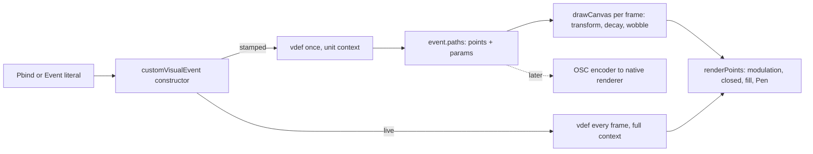

# Stamped Visual Events

2026-09-25

## Why

The visual pipeline in `code3.0/visualCore.scd` runs every vdef, every frame, on
the one sclang interpreter thread that also runs up to nine `~next` routines at
100 Hz. Qt then rasterises on the CPU. On a Raspberry Pi the GPU does nothing,
and the drawing competes directly with the music.

The goal is a native renderer on the Pi (C or C++, GLES over KMS) that takes the
geometry over OSC, while the vdefs stay in sclang so a personality file keeps
owning its visual and hot-reload on save keeps working. That only works if a
mark can be described once, at fire time, as a point array plus parameters,
with all per-frame motion computed by the renderer.

The Qt pipeline stays. It becomes the reference implementation of that data
model and the desktop fallback. So the first move is inside the current
renderer: convert transient events from per-frame vdef evaluation to
evaluate-once-plus-parameters, behind a flag that is off by default. Nothing
about the sound changes (rule zero).

## Audit of every vdef

Every `~vdef` in `personalities/` falls into one of two classes. The transient
class depends only on time since fire and converts cleanly. The live class
steps a simulation or reads the model at frame rate and must keep the current
contract.

| File | Shape | Class | Per-frame inputs | Converts to |
| --- | --- | --- | --- | --- |
| bongo1 | membrane | transient | normTime: chirp and four mode decays; `c[\draw]` with pos and size overrides | sub-path offset/scale, `aTau`/`wTau` per ring |
| magicWand | partialComb | transient | normTime: six partial decays | `aTau`/`wTau` per partial |
| bells | shards | transient | normTime pow hold: shards separate | `drift` per shard |
| celeste1 | (rings and reach line) | transient | normTime: decay, size growth, line placement | `aTau`, `drift`, sub-path scale |
| metal1 | morphLine | transient | normTime easing, `c[\now]` wobble phase | `wobble` (harm, hz, amp, ease) |
| droplet | (wobbling ring) | transient | `c[\now]` wobble phase | `wobble` |
| miniMoog | superellipse | transient | none beyond size | points only |
| multiBeat5 | slab | transient | width as depth, ghost alpha | points, `aScale` |
| trainBass2, trainBass3 | (rim, tail, head) | transient | size as radius, `c[\draw]` circle at rim | sub-path offset/scale |
| trainChooka2, trainChooka3 | (dot on ring) | transient | size as radius | sub-path offset/scale |
| trainMelody2 | (arc fan) | transient | size as radius | points only |
| templates | (examples) | transient | normTime | points only |
| bee | (bee and trail) | live, `duration: inf` | model at frame rate; integrates a chaotic position and a trail accumulator | stays live |
| pluck1 | rubberBand | live, `duration: inf` | model at frame rate; `sincePluck` and `lastNow` accumulators | stays live |
| multiBeatSynth1 | (lobed ring) | live, `duration: inf` | model amplitude and drone note per frame | stays live |
| metal1 | sheetFrame | live, `duration: inf` | model drive per frame; the one `Pen` case | stays live |

Four parameters cover every transient file: exponential decay of alpha and
width (`aTau`, `wTau`), a unit-space offset reached at the end of the event
(`drift`), an angular wobble with a free-running phase (`wobble`), and
per-sub-path placement (`offset`, `scale`, `rot`). No transient vdef reads the
model. That is the whole parametric set the renderer needs.

## Two event kinds

A visual event is either **stamped** or **live**. The kind is decided at fire
time and never changes.

| | Stamped | Live |
| --- | --- | --- |
| When the vdef runs | once, at fire time | every frame, as today |
| Context it receives | unit context: `pos` 0@0, `size` 1, `width` 1, `normTime` 0 | full context: pixel `pos`, `size`, `normTime`, `elapsed`, `now` |
| What it returns | points in unit space, plus sub-paths appended through `c[\render]` and `c[\draw]` | absolute canvas points, drawn immediately |
| Where motion comes from | event keys and per-sub-path parameters, applied by the renderer | the vdef reading `m` and its own accumulators |
| Selected by | `\stamped, true` (later the default) | `duration: inf`, or `\stamped, false` |
| On the wire, later | one bundle per event | one bundle at fire, then points re-sent at a tick rate |

The stamped contract removes `c[\pos]`, `c[\size]` and `c[\bounds]` from the
vdef. Geometry is unit space centred on the origin with radius 1. Position,
size, rotation and the envelopes are renderer transforms, which is what the
"stay on the API" rule in CLAUDE.md already asks for. A pixel constant inside a
vdef, such as magicWand's lane of 26 px, becomes a unit constant relative to
size, supplied through `\modulation` as the tightness rule requires.

The live contract is unchanged. bee and pluck1 are simulations stepped per
frame with file-level accumulators, exactly the case CLAUDE.md carves out. The
"never relay values through file-level vars" rule survives because a live vdef
keeps reading `m` directly.

`c[\render]` and `c[\draw]` gain one optional trailing Event of sub-path
parameters:

```supercollider
c[\render].(points, wScale, aScale, closed, (aTau: 0.3, wTau: 0.3))
c[\draw].(\circle, (offset: 0@0, scale: 0.5), a, a, nil, (aTau: modeDecays[i]))
```

| Key | Meaning | Default |
| --- | --- | --- |
| `offset` | sub-path origin in unit space, relative to the mark | 0@0 |
| `scale` | sub-path size relative to the mark's size | 1 |
| `rot` | sub-path rotation about its own origin, radians | 0 |
| `aTau` | alpha scale decays as exp(-normTime / aTau) | none |
| `wTau` | width scale decays as exp(-normTime / wTau) | none |
| `drift` | unit-space offset reached at normTime 1, linear | 0@0 |
| `wobble` | `(harm, hz, amp, ease)` angular displacement with a free-running phase | none |

In a stamped vdef these calls append to the event's sub-path list instead of
drawing. In a live vdef they draw, as now.

## The first move, inside visualCore.scd

Five changes, all in `code3.0/visualCore.scd`, none in a SynthDef, mapping,
`Pbind` or `~plot`. With the flag off, every existing personality behaves
exactly as today.

1. **A `\stamped` key on the event.** Carried by the constructor at line 365,
   default `false`. Forced to `false` when `duration` is `inf`. Unset, nothing
   changes.
2. **Fire-time evaluation.** When a stamped event is constructed, run its vdef
   once with the unit context. `c[\render]` and `c[\draw]` are bound to append
   `(points, wScale, aScale, closed, params)` to `event[\paths]`. A points
   func's return value becomes sub-path zero. A draw func's return is ignored,
   as now. The event leaves the constructor carrying its geometry as data and
   never calls the vdef again.
3. **The per-frame path for stamped events.** In `drawCanvas`, a stamped event
   skips the vdef and walks `event[\paths]`. For each sub-path: transform unit
   points by the event's blended position, size and rotation, then by the
   sub-path's own `offset`, `scale` and `rot`, add `drift` times `normTime`,
   apply `wobble` with the phase from `now`, and multiply `wScale` and `aScale`
   by their decays. The result goes to the existing `renderPoints`, so
   modulation, closed, fill and `Pen` are untouched below that line. The
   `\noise` modulation seed from `now` already lives there.
4. **The live path is unchanged.** An unstamped event runs its vdef per frame
   with the full context, as today. Held events, the cull, `clearEvents` and
   `applyScene` are not touched.
5. **A dump.** `core.dumpEvent(event)` prints a stamped event's keys and
   sub-path list as plain data, one line per sub-path. This is the wire format
   before there is a wire. It is how the native renderer will be checked
   against this one, and how a converted p-file is compared with its
   unconverted version.



The stamped branch is new. The live branch is the code as it stands. Both end
in the same `renderPoints`.

Two details to get right in step 3. First, `normTime` for the decays and drift
comes from the event's own `duration`, so a sub-path's tau is in event time,
not seconds; that matches how bongo1 and magicWand already compute their decays
from `c[\normTime]`. Second, the sub-path transform is applied before
`Pen.rotate` unwinds, so `rot` composes with the event's `\rotation` the same
way `c[\draw]` overrides do today.

## What it buys and what it does not

- **It does not make the Qt path much faster.** The vdef body no longer runs
  per frame, but the transform, modulation and `Pen` walk are still sclang per
  point. Measure `drawCanvas` per frame before and after anyway; the number is
  needed to justify the native renderer, and `systemView.scd` already reads
  load and thermal.
- **It fixes the data model.** After this, a mark is a point array plus a small
  parameter block. The OSC encoder is a serialiser of that structure, and the
  Qt renderer is the reference the native one is checked against, sub-path by
  sub-path, through the dump.
- **It tightens the vdef contract.** Stamped vdefs cannot read `c[\pos]`,
  `c[\size]` or `c[\bounds]`, which closes off the class of mistakes the "stay
  on the API" section of CLAUDE.md is about.
- **It costs an edit per transient p-file.** Pixel constants become unit
  constants relative to size, `(pos:, size:)` overrides become `offset` and
  `scale`, and per-frame decays become `aTau`, `wTau`, `drift` or `wobble`.
  Geometry only; the synth in each file is untouched.
- **It leaves the live class alone.** bee, pluck1, multiBeatSynth1 and metal1's
  sheetFrame keep the current contract. On the wire they become the tick-rate
  re-send path, and they define what that path needs when you get to it.
- **One risk.** A transient effect not in the four-parameter set cannot be
  expressed. The audit found none, but a new p-file may want one. The answer is
  to add a parameter, not to reach for `Pen` or for a per-frame vdef.

## Order of conversion

Each step is one commit. Each p-file conversion is compared against its
unconverted version on the same events before the next one starts.

- [ ] **Core change, flag off.** `\stamped` key, fire-time evaluation, the
      per-frame transform path, `core.dumpEvent`. Nothing visible changes.
      Reload `main.sc`, not just a personality, because `Require` caches the
      core.
- [ ] **bongo1.** First because it exercises `c[\draw]`, sub-path placement and
      per-ring decays in one vdef. Rings get `aTau: modeDecays[i]`, the arc
      keeps its alpha. Rests still leave gaps.
- [ ] **magicWand.** Six partials with their own `aTau`. The lane of 26 px
      becomes a unit constant on `\modulation`.
- [ ] **bells.** Each shard gets `drift`; the hold exponent becomes the drift
      easing if needed, otherwise linear.
- [ ] **celeste1.** Decay, size growth and the reach line as sub-path scale and
      `drift`.
- [ ] **metal1 morphLine and droplet.** The `wobble` parameter. sheetFrame
      stays live.
- [ ] **trainBass2, trainBass3, trainChooka2, trainChooka3, trainMelody2,
      multiBeat5, miniMoog.** Placement only, no time parameters.
- [ ] **Templates.** `_TEMPLATE_ak_pfile.sc` written against the stamped
      contract; `templateVisual.sc` annotated to match.
- [ ] **Flip the default.** `\stamped` defaults to `true` once the transient
      list is empty. `duration: inf` still forces live. CLAUDE.md section A
      updated for the unit context and the sub-path parameters.
- [ ] **Measure.** `drawCanvas` per frame on a real kit, two devices, a
      sample-heavy personality, HDMI. This number decides whether the native
      renderer is worth building.

bee, pluck1, multiBeatSynth1 and metal1 sheetFrame are not on this list. They
are converted, if at all, when the wire exists.

## Later: the wire and the native renderer

Once stamped events exist as data, the encoder is a serialiser. One OSC bundle
per event, timetagged with `core.latency` in place of the current stamp-ahead
scheme. The message set is the old `VisualServer` protocol (`vnew`, `vset`,
`vfree`) with a native backend instead of sclang.

```
/vis/new    id viewID duration  sx sy ex ey  startSize endSize  startWidth endWidth
            startColor(rgba) endColor(rgba)  rotation  xEnv yEnv sizeEnv widthEnv colorEnv
            modType modAmp modHarm modRate
/vis/path   id sub closed fill  offX offY scale rot  wScale aScale aTau wTau  driftX driftY
            wobHarm wobHz wobAmp wobEase  x0 y0 x1 y1 ...
/vis/set    id key value              (held events, Pdef.set-style tweaks)
/vis/points id sub x0 y0 ...          (live events, re-sent at a tick rate)
/vis/free   id
/vis/clear  viewID                    (replaces clearEvents on personality unload)
```

Envelopes go as a shape id plus a curve value, matching the `Env` forms the
p-files already use. Thirty two points is 256 bytes, so a mark with a dozen
sub-paths fits one UDP bundle, and events are sparse. The whole per-frame cost
moves to the renderer.

On the Pi: GLES 2 or 3 straight to KMS/DRM through Mesa's V3D driver, no X
server, which also retires the `xrandr` shell-out in `screens.scd`. SDL2 plus a
hand-rolled polyline renderer, or raylib in DRM mode. Stroked lines wider than
1 px are unreliable as `GL_LINES` on GLES, so polylines are expanded to triangle
strips with joins and caps. The four modulation modes at lines 120 to 150 of
`visualCore.scd` are ported verbatim, including the sine window and the noise
seed, so a converted personality looks the same on both renderers. Two
processes on the kiosk means a systemd unit each, with the renderer independent
of sclang so a personality reload never blanks the screen.

A missing `viewID` should still drop the picture and keep the sound. The router
moves to the renderer, keyed the same way.

Open questions:

- [ ] Does the measured `drawCanvas` cost on a real kit justify the renderer at
      all?
- [ ] Tick rate for live re-sends: 20 Hz is the working guess; bee's trail may
      want more.
- [ ] Which Pi and which OS image the kits actually run, since KMS versus X11
      versus labwc decides the windowing code.
